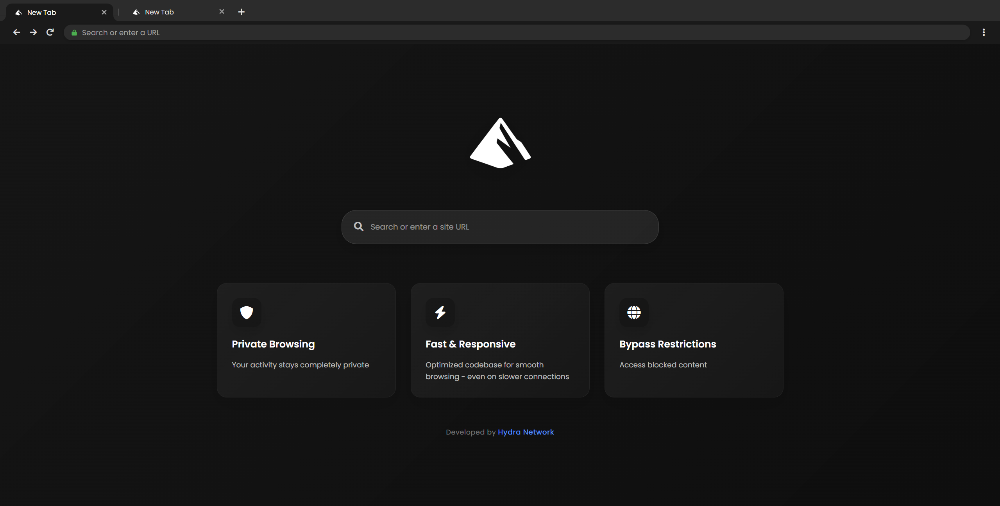

# Glint ✨

<div align="center">
  
</div>

## 🌐 Live Demo

Try Glint now: https://glintapp.org/
## 🚀 Getting Started

### Prerequisites
- Node.js
- npm

### Installation

1. Clone the repository:
   ```bash
   git clone https://github.com/Galaxy-Vortex/Glint
   ```

2. Install dependencies:
   ```bash
   npm i
   ```

3. Start the server:
   ```bash
   npm start
   ```

### Configuration
The default port for Glint is `3000`. You can access it by visiting `localhost:3000` in your web browser.

> **Note:** If port 3000 is already in use, you can change the port in the `app.js` file.

## 🔗 Connect

Join the [Galaxy Network](https://discord.gg/jMsj6KJBSV) for additional links and updates!

## ⚠️ Development Status

**Note:** Glint is still under active development with many more updates planned.
