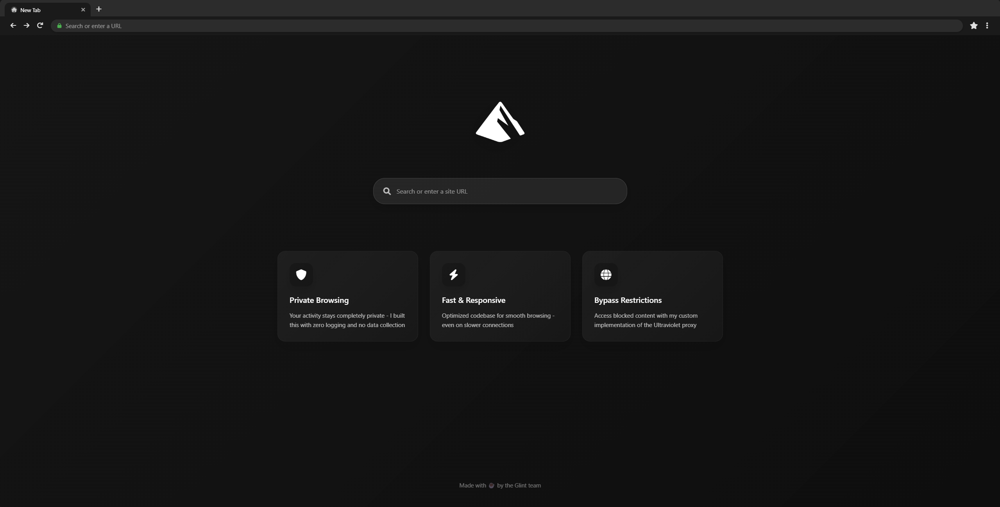

# Glint

<div align="center">
  
</div>

## Live Demo

Try Glint now: https://glintapp.org/
## 🚀 Getting Started

### Prerequisites
- Node.js
- npm

### Installation

1. Clone the repository:
   ```bash
   git clone https://github.com/Galaxy-Vortex/Glint
   ```

2. Install dependencies:
   ```bash
   npm i
   ```

3. Start the server:
   ```bash
   npm start
   ```

## Connect

Join the [Hydra Network](https://discord.gg/jMsj6KJBSV) for additional links and updates!

## ⚠️ Development Status

**Note:** Glint is still under active development with many more updates planned.
